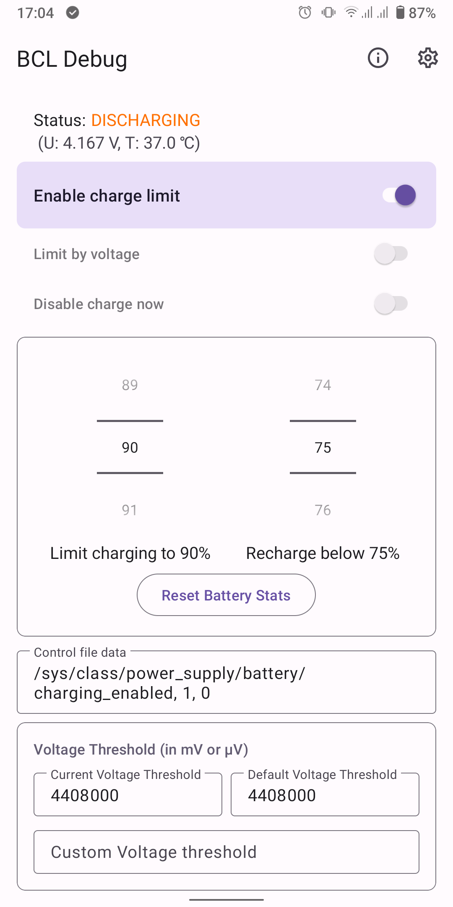
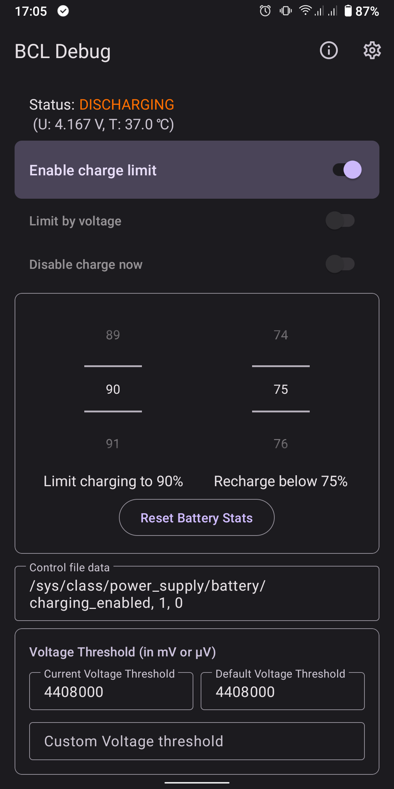
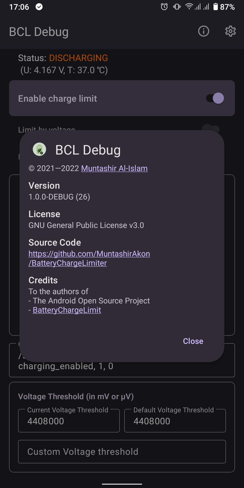

# Battery Charge Limiter (BCL)

A fork of **Battery Charge Limit** whose development has been stalled for some time.
**Battery Charge Limit** 的一个维护停滞分支复刻(Fork)。

_This app is a work in progress. If a feature is not working, do not hesitate to file a report._
_本项目仍在持续开发中。如有功能异常,欢迎提交 Issue 反馈。_

**NOTE:** This app currently requires root to function.
**注意:** 本应用目前需要 root 权限才能正常工作。

## Features / 功能

- Free and open source / 免费开源。
- Material 3 with dynamic colours / Material 3 动态取色设计。
- Control when to start and stop charging — either directly or an via widget / 控制充电的启停——可通过应用或桌面小组件。
- Set voltage threshold / 设置电压阈值。
- Set custom battery control configuration if the supplied ones cannot be used properly / 内置控制文件不适用时,可自定义电池控制配置。
- Auto shutdown on low battery(30 s below the threshold, via root)/ 低电量自动关机(电量持续低于阈值 30 秒,通过 root 关机)。

## Power-Saving Optimizations / 省电优化

This fork focuses on minimizing power consumption. The previous design kept two
foreground services resident at all times, registered a dynamic battery receiver
and rebuilt notifications on every battery event (about 60 wake-ups per hour per
service). The new design makes monitoring entirely wake-up-driven:
本分支以极致省电为目标。旧架构常驻两个前台服务、动态注册电池接收器,且每次电池事件都重建通知(每个服务约每小时被唤醒 60 次)。新架构让监控完全由唤醒驱动:

### 1. Non-resident monitoring service / 非驻留监控服务

The auto shutdown service no longer stays resident. Every wake-up (boot, power
connect/disconnect or the scheduled alarm) starts it once, it reads the sticky
battery snapshot, re-arms the next wake-up and stops itself:
低电压关机服务不再常驻。每次唤醒(开机、插拔电源或闹钟到点)启动一次,读取系统粘性电量快照、重排下一次唤醒、更新通知后立即自杀(stopSelf):

```
AlarmManager → PendingIntent → short-lived Service → read battery → schedule next → stopSelf
```

No foreground service, no persistent notification, no dynamic battery receiver —
the process leaves nothing behind. A full discharge cycle previously woke the app
about 1800 times; the new design needs fewer than 100.
无前台服务、无常驻通知、无动态接收器——进程零残留。一个完整放电周期从约 1800 次应用唤醒下降到不足 100 次。

### 2. Adaptive heartbeat schedule / 自适应心跳档位

The monitoring frequency follows the remaining capacity — the lower the battery,
the shorter the interval:
监控频率与剩余电量成反比——电量越低,唤醒越密集:

| Battery level / 电量 | Wake-up interval / 唤醒间隔 | API |
|---|---|---|
| ≥ 80% | 60 min / 60 分钟 | `setAndAllowWhileIdle` |
| 60–80% | 45 min / 45 分钟 | `setAndAllowWhileIdle` |
| 30–60% | 20 min / 20 分钟 | `setAndAllowWhileIdle` |
| throttle+5% – 30% | 9 min / 9 分钟 | `setExactAndAllowWhileIdle` |
| < threshold+5% (default 10%) / 阈值+5%(默认 10%) | 60 s / 60 秒(system floor 9 min in Doze / Doze 深睡下限 9 分钟) | `setExactAndAllowWhileIdle` |

The 30-second "below threshold" countdown is persisted and kept across wake-ups,
so it stays correct even with sparse events during deep sleep.
"持续低于阈值 30 秒"的倒计时状态跨唤醒持久化,深睡期间事件稀疏时语义依然正确。

### 3. Symmetric suspension by power state / 插电/拔电对称休眠

- **Plugged in / 插着电**: the charge limiting service runs at full speed; the
  auto shutdown feature suspends itself — alarm and notification cancelled, no
  work at all / 充电限制服务全速运行;低电压关机自动挂起——撤销闹钟与通知,完全不做任何事。
- **Unplugged / 拔掉电**: the charge limiting service stops (zero wake-ups while
  not charging); the auto shutdown feature resumes immediately and picks the
  schedule band from the **actual battery level at the moment of unplugging**
  (e.g. 18% → 9-minute band, not the previous plan) / 充电限制服务停止(未充电时零唤醒);低电压关机立即复活,并按**拔线瞬间的实际电量**重新定档(如 18% 直接进入 9 分钟档,而非沿用旧计划)。

Both transitions are triggered instantly by the manifest-declared power
broadcast receiver, without waiting for any timer.
两个切换都由 Manifest 注册的电源广播接收器即时触发,无需等待任何定时器。

### 4. Static low-battery notification / 低电量静态通知

Below 20% the notification switches to a single static message
"Low battery, please charge · auto shutdown at X%" and is **never rebuilt**
until the battery recovers above 20% — each alarm wake in the precision zone
no longer pays for a `notify()` round-trip.
低于 20% 时,通知切换为一条静态文案"电量低,请充电 · 低于 X% 将自动关机",之后**不再重建**,直到电量回升到 20% 以上——精确区每 60 秒的唤醒不再产生一次 `notify()` 开销。

### 5. Code hygiene / 代码卫生

Replaced deprecated APIs (`Bundle.get`, `setTargetFragment`) and removed dead
code, eliminating all build warnings.
替换弃用 API(`Bundle.get`、`setTargetFragment`)并清理死代码,构建警告清零。

## Troubleshooting / 故障排查

If BCL cannot start or stop charging correctly, enable **Always Write CTRL File**
in the settings.
如果 BCL 无法正确开始或停止充电,请在设置中启用**始终写入 CTRL 文件**。

## Screenshots / 截图



## License / 许可证

GNU General Public License v3.0